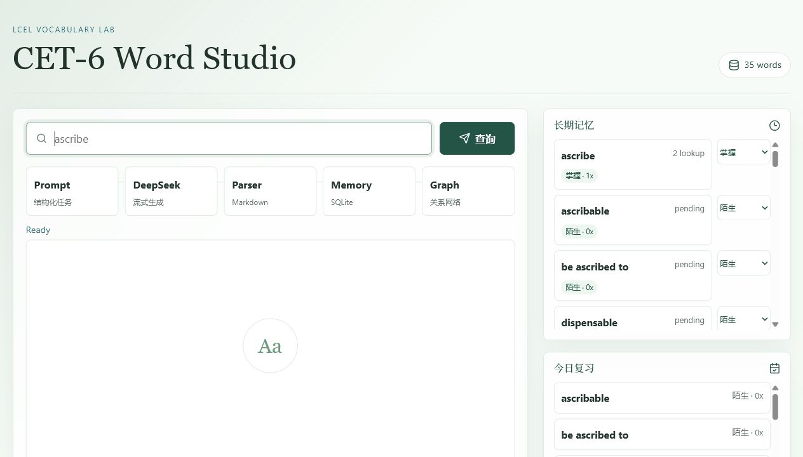
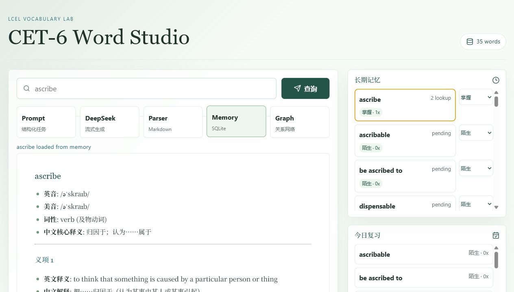
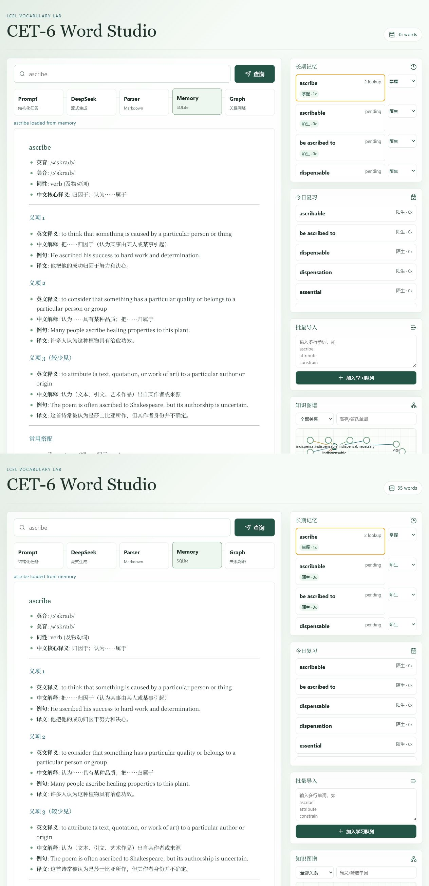
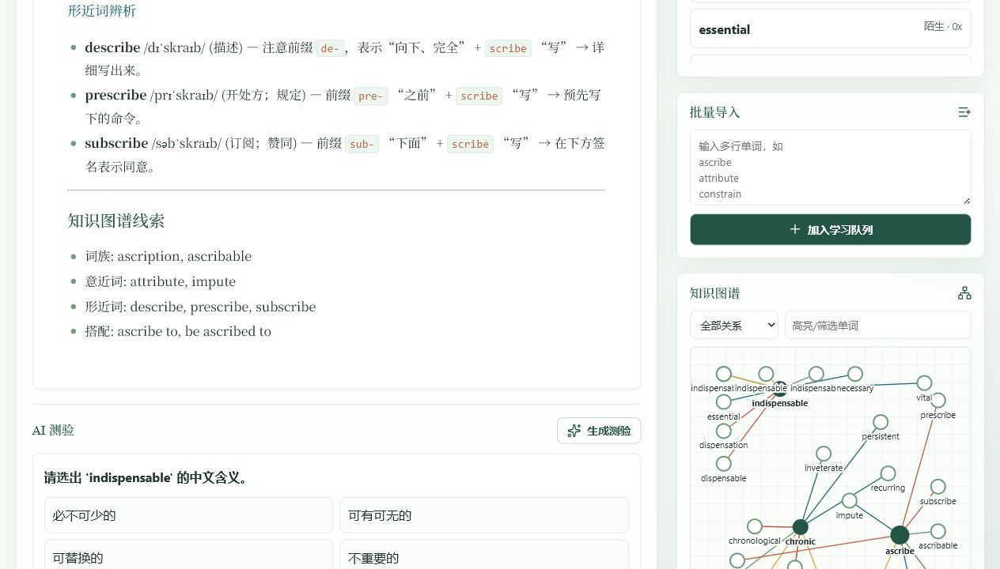
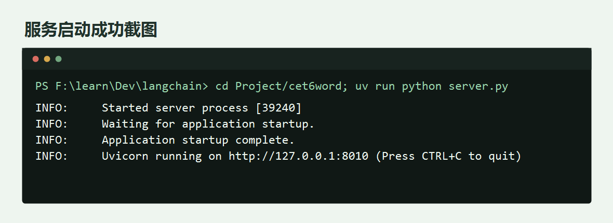
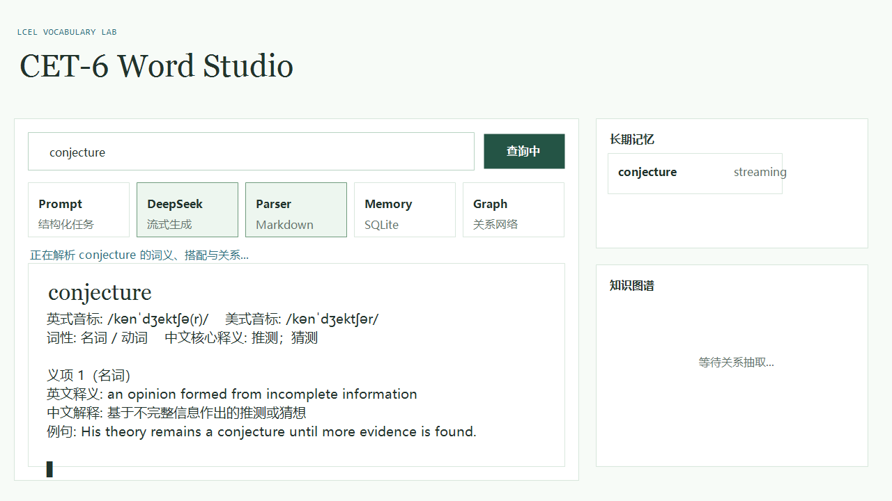
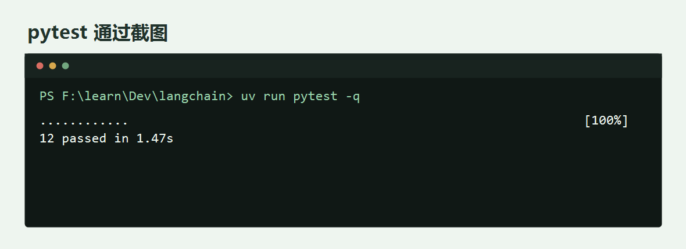
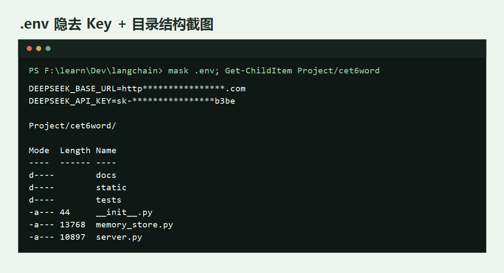
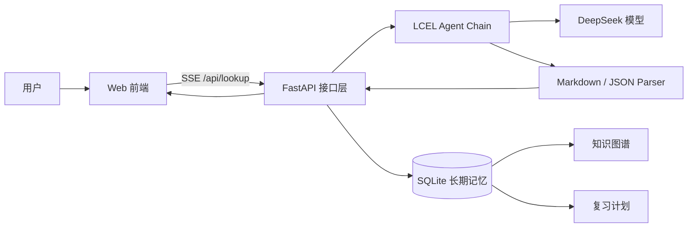

# CET-6 Word Agent

> 软件体系结构课程大作业：智能体（Agent）系统体系结构设计与 Demo 实现  
> 学号：2310460  
> 姓名：王秀强

CET-6 Word Agent 是一个面向大学英语六级词汇学习的智能体 Demo。系统以 LangChain LCEL 为核心，把“查词解释、长期记忆、复习调度、AI 测验、知识图谱”整合为一个可交互 Web 应用，用于展示智能体系统中的感知、决策、执行与反馈闭环。

## 功能展示

### 1. 学习工作台首页



### 2. LCEL 流式查词与 Markdown 解释



### 3. 长期记忆与今日复习



### 4. AI 测验与知识图谱



## 运行与验证截图

### 1. 服务启动成功



### 2. SSE / Agent 流式输出中间态



### 3. pytest 测试通过



### 4. `.env` 掩码与目录结构



## 核心功能

- **LCEL 流式查词**：前端通过 Server-Sent Events 接收 DeepSeek 模型逐 token 输出，实时渲染 Markdown。
- **长期记忆存储**：使用 SQLite 保存单词解释、查询次数、掌握度、复习次数和图谱关系。
- **复习计划**：系统根据测验结果更新 `next_review_at`，形成“今日复习”队列。
- **掌握度标记**：支持 `陌生`、`模糊`、`掌握` 三档学习状态，用户反馈会持续写入记忆库。
- **AI 测验**：基于已保存词汇生成选择题，答题结果用于更新复习计划。
- **批量导入**：支持多行导入单词，先加入学习队列，不立即调用模型，避免 API 调用过量。
- **知识图谱**：自动抽取词族、意近词、形近词、搭配关系，并支持关系类型筛选和搜索。

## 技术栈

| 层次 | 技术 |
|---|---|
| 前端 | HTML, CSS, Vanilla JavaScript, marked.js, lucide icons |
| 后端 | FastAPI, Uvicorn, Server-Sent Events |
| 智能体链路 | LangChain LCEL, DeepSeek Chat Model |
| 存储 | SQLite |
| 测试 | pytest, FastAPI TestClient |

## 系统架构

系统采用 **分层架构 + 事件流架构**：

- 表现层：负责输入单词、显示解释、复习队列、测验和图谱。
- 接口层：FastAPI 暴露查词、记忆、复习、测验、导入和图谱 API。
- Agent 层：通过 LCEL 组合 Prompt、LLM、Output Parser。
- 记忆层：SQLite 维护长期记忆、复习计划、测验结果和关系边。



## Agent 行为闭环

| 阶段 | 本系统实现 |
|---|---|
| 感知 | 接收用户输入的单词、批量词表、掌握度反馈、测验答案 |
| 决策 | 判断是否查词、是否加入复习队列、测验结果如何影响掌握度 |
| 执行 | 调用 DeepSeek 生成解释或测验，保存记忆，更新图谱 |
| 反馈 | 流式展示解释、刷新长期记忆、更新今日复习和知识图谱 |

## 智能体设计模式

1. **反应式 Agent**
   - 用户输入单词后，系统立即触发 LCEL 链路并流式返回结果。
   - 适合查词这种强交互、低延迟的任务。

2. **记忆增强 Agent**
   - 每次查词结果、词间关系、掌握度都会写入 SQLite。
   - 后续复习、测验和图谱展示都基于长期记忆，不依赖一次性会话上下文。

3. **规划/调度 Agent**
   - 系统根据测验正确与否更新复习次数和下次复习时间。
   - “今日复习”面板体现 Agent 对学习任务的持续调度。

## 4+1 视图

| 视图 | 说明 |
|---|---|
| 逻辑视图 | `FastAPI API`、`LCEL Agent Chain`、`MemoryStore`、`Graph Renderer`、`Review Scheduler` |
| 开发视图 | `Project/cet6word/server.py` 负责接口，`memory_store.py` 负责 SQLite，`static/` 负责前端 |
| 进程视图 | 浏览器通过 SSE 与 FastAPI 保持流式连接；普通 API 使用 HTTP JSON |
| 物理视图 | 单机部署：浏览器、Python Web 服务、SQLite 文件、DeepSeek 云端 API |
| 场景视图 | 用户查询单词 -> Agent 生成解释 -> 写入长期记忆 -> 更新图谱 -> 生成测验 -> 回写复习计划 |

## 目录结构

```text
Project/cet6word/
├── server.py              # FastAPI 后端与 LCEL Agent 接口
├── memory_store.py        # SQLite 长期记忆、复习计划、图谱与测验结果
├── static/
│   ├── index.html         # 前端页面
│   ├── style.css          # 清爽学习工作台样式
│   └── app.js             # 前端交互逻辑
├── tests/
│   ├── test_memory_store.py
│   └── test_api.py
└── docs/images/           # README 浏览器截图
```

## 安装与运行

### 1. 准备环境

项目要求 Python 3.12+，使用 `uv` 管理依赖。

```bash
uv sync
```

### 2. 配置 API Key

在项目根目录创建 `.env`：

```env
DEEPSEEK_API_KEY=your_deepseek_api_key
```

`.env` 不应提交到 Git。

### 3. 启动服务

```bash
cd Project/cet6word
uv run python server.py
```

访问：

```text
http://127.0.0.1:8010
```

## Vercel 部署

本项目使用 Vercel Python Runtime 部署 FastAPI。部署根目录建议选择：

```text
Project/cet6word
```

该目录下已经包含 Vercel 部署所需文件：

```text
Project/cet6word/
├── server.py
├── requirements.txt
├── vercel.json
├── .vercelignore
└── .python-version
```

部署步骤：

```bash
cd Project/cet6word
vercel login
vercel link
vercel env add DEEPSEEK_API_KEY production
vercel env add DEEPSEEK_BASE_URL production
vercel --prod
```

说明：

- `DEEPSEEK_API_KEY` 必须在 Vercel 环境变量中配置，不能提交到 Git。
- 本地运行使用 `Project/cet6word/data/cet6_memory.sqlite3`。
- Vercel Serverless 环境中 SQLite 数据写入 `/tmp/cet6word`，适合课程 Demo 演示；它不是稳定的云端长期数据库。
- 如果要作为正式多用户产品，需要替换为 Vercel Postgres、Neon、Supabase 等持久化数据库。

## API 摘要

| 方法 | 路径 | 作用 |
|---|---|---|
| GET | `/api/lookup?word=ascribe` | SSE 流式查词 |
| GET | `/api/memory?include_pending=true` | 获取长期记忆 |
| GET | `/api/review/due` | 获取今日复习单词 |
| POST | `/api/word/{word}/mastery` | 更新掌握度 |
| POST | `/api/import` | 批量导入单词 |
| POST | `/api/quiz` | 生成 AI 测验 |
| POST | `/api/quiz/result` | 保存测验结果 |
| GET | `/api/graph?relation=synonym&q=ascribe` | 获取筛选后的知识图谱 |

## 测试

```bash
uv run pytest Project/cet6word/tests -q
uv run python -m compileall Project/cet6word
```

当前测试覆盖：

- 记忆持久化
- 掌握度更新
- 到期复习筛选
- 批量导入去重
- 图谱关系筛选
- 测验结果保存
- 主要 FastAPI 接口

## 课程要求对应

| 课程要求 | 本项目对应内容 |
|---|---|
| 用户需求 | CET-6 学生需要查词、复习、测验和理解词间关系 |
| 功能分解 | 查词 Agent、记忆模块、复习调度、测验生成、图谱模块 |
| 体系风格设计 | 分层架构 + 事件流架构 |
| 智能体设计模式 | 反应式 Agent、记忆增强 Agent、规划/调度 Agent |
| 4+1 视图 | README 中给出逻辑、开发、进程、物理、场景视图 |
| Demo 实现 | 可运行 Web Demo，展示智能体核心行为 |
